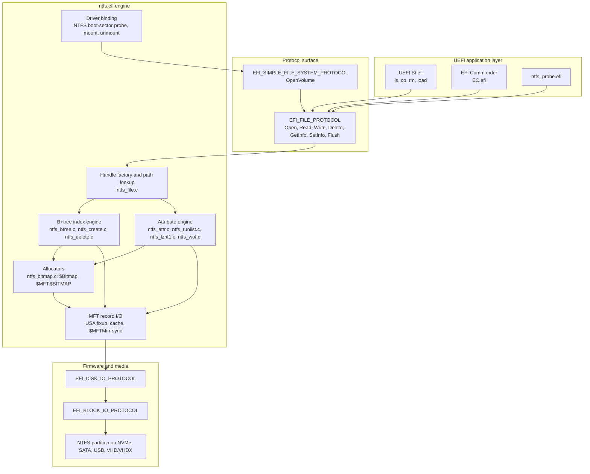
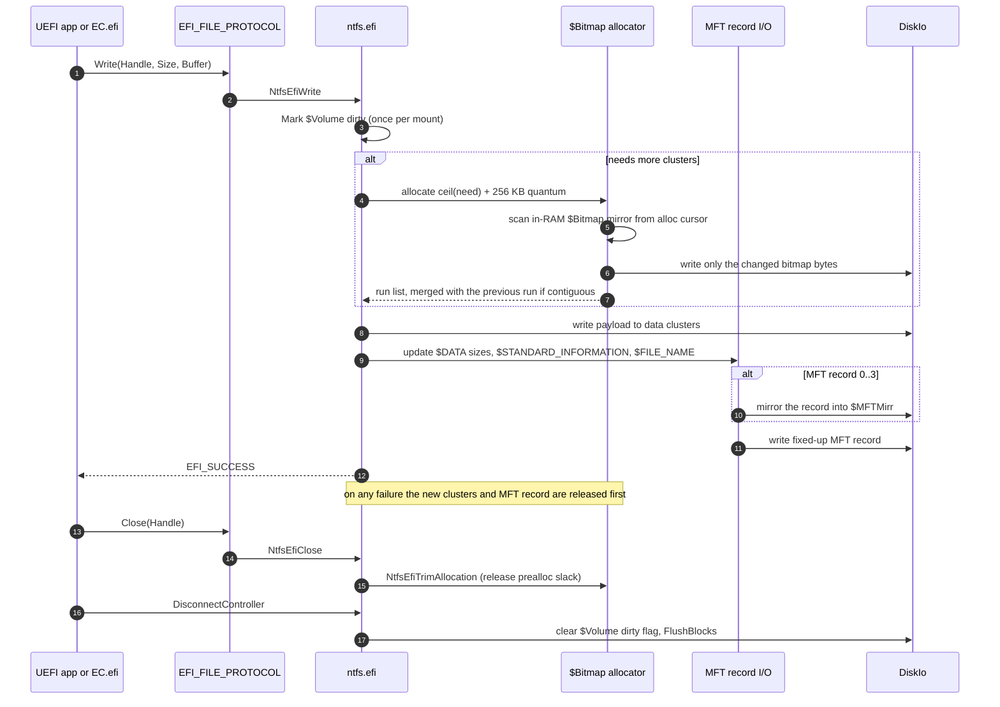
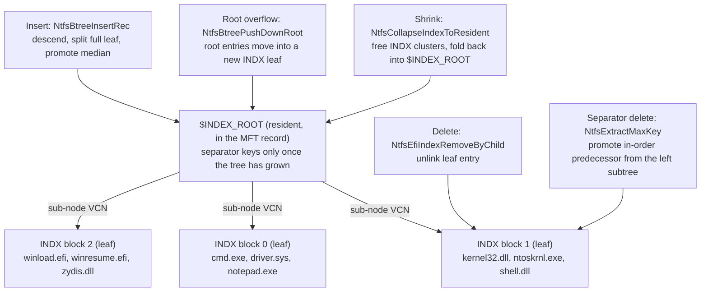
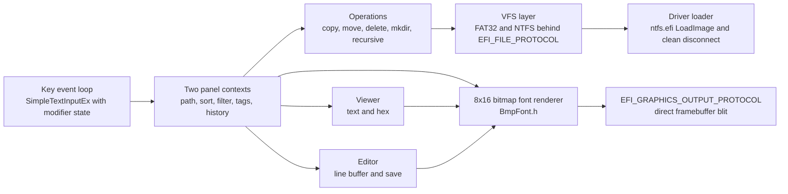
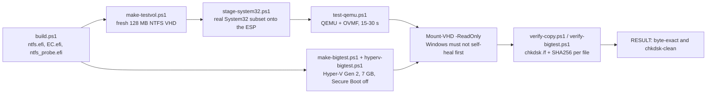

<div align="center">


[](https://github.com/wesmar/NTFS_EFI/releases/latest)

**[⬇ Download NTFS_EFI.7z](https://github.com/wesmar/NTFS_EFI/releases/download/latest/NTFS_EFI.7z)**
&nbsp;·&nbsp;
**[Source Code](https://github.com/wesmar/NTFS_EFI/archive/refs/heads/main.zip)**
&nbsp;·&nbsp;
**[All Releases](https://github.com/wesmar/NTFS_EFI/releases)**

> No archive password. Extract and copy the three `.efi` files.

[](LICENSE.md)
[]()
[]()
[]()

</div>

# EfiNtfs & EFI Commander — NTFS Read/Write Driver and File Manager for UEFI

<br>

<div align="center">

**Write to NTFS from firmware • `EFI_SIMPLE_FILE_SYSTEM_PROTOCOL` • chkdsk-clean unmount**

*B+tree index splits and collapses, `$MFT` growth, `$MFTMirr` lock-step mirroring, `$UpCase` collation*

*Pure C, plain MSVC `.vcxproj`, no EDK2 build system, no `ntfs-3g`*

</div>

<!-- SCREENSHOTS / VIDEO — drop files into images/ and uncomment:


<div align="center">

[](https://www.youtube.com/watch?v=VIDEO_ID)

</div>
-->

> **`ntfs.efi`** is a native NTFS **read + write** file system driver for UEFI x64, written in pure C. No EDK2 Python build system, no `ntfs-3g`, no POSIX emulation layer. It registers an `EFI_DRIVER_BINDING_PROTOCOL`, binds to every disk handle carrying a valid NTFS boot sector, and exposes the volume through `EFI_SIMPLE_FILE_SYSTEM_PROTOCOL` — exactly the interface the firmware's own FAT driver provides for FAT32. Every existing UEFI application, shell command or bootloader can therefore create, write, rename, move and delete files on NTFS with no code change. Volumes unmount **chkdsk-clean** and copies verify **SHA256 byte-exact** on Windows 11.
>
> **`EC.efi` (EFI Commander)** is a dual-panel file manager for the pre-boot environment (Norton Commander / Far Manager layout), shipped with the driver. It renders directly into the Graphics Output Protocol framebuffer with an embedded 8x16 bitmap font, bridges FAT32 and NTFS volumes behind one VFS layer, loads `ntfs.efi` itself when the firmware has not, and disconnects it cleanly on exit so the dirty flag is cleared.

---

## Table of Contents

- [Overview](#overview)
- [Components](#components)
- [Architecture](#architecture)
- [Read Path](#read-path)
- [Write Path](#write-path)
- [B+Tree Index Engine](#btree-index-engine)
- [Performance Engineering](#performance-engineering)
- [On-Disk Structures](#on-disk-structures)
- [Source Layout](#source-layout)
- [EFI Commander](#efi-commander)
- [ntfs_probe — Test Harness](#ntfs_probe--test-harness)
- [Testing and Validation](#testing-and-validation)
- [Status Codes](#status-codes)
- [Known Limitations](#known-limitations)
- [Deployment Layout](#deployment-layout)
- [Usage](#usage)
- [Building from Source](#building-from-source)
- [License](#license)

---

## Overview

UEFI firmware reads and writes FAT12/FAT16/FAT32 and nothing else. Every task that needs write access to an NTFS partition before an operating system starts — offline registry repair, bootloader patching, driver staging, forensic extraction, unattended recovery — has therefore required booting a full WinPE image or a Linux initrd with `ntfs-3g`, hundreds of megabytes of runtime to move a few files.

EfiNtfs closes that gap at the firmware layer. The driver is a DXE-loadable UEFI driver of a few hundred kilobytes that hands NTFS volumes to the rest of the firmware through the standard protocol, so the caller does not know or care that the volume is not FAT.

| Approach | What it costs | NTFS write |
|---|---|---|
| Firmware FAT driver | nothing, it is already there | none at all |
| WinPE / Windows RE | ~400 MB image, a full Windows kernel boot | yes |
| Linux initrd + `ntfs-3g` | 50-200 MB image, Linux kernel, FUSE, POSIX layer | yes |
| Read-only UEFI NTFS drivers | one small driver binary | read only |
| **EfiNtfs (`ntfs.efi`)** | **one UEFI driver binary, `BlockIo` + `DiskIo` and nothing else** | **yes, chkdsk-clean** |

Design constraints that shaped the code:

- **No cache manager, no MCB, no FsRtl.** Run lists are decoded once into a flat array; attribute reads go straight to `EFI_DISK_IO_PROTOCOL`.
- **No CRT, no C++, no exceptions.** Pure C11 against a small set of prebuilt EDK2 static libraries under `lib/`.
- **Fail-closed on anything unrecognised.** A corrupt USA fixup or an unknown compression form rejects the operation instead of guessing.
- **Every write ordered so a crash leaks, never dangles.** Clusters are allocated and data written before the MFT record starts pointing at them; on failure the allocation is released.

---

## Components

| Binary | Role | Project |
|---|---|---|
| `ntfs.efi` | UEFI driver (`EFI_DRIVER_BINDING_PROTOCOL`) — the NTFS read and write engine; mounts every NTFS partition it is connected to | `src/ntfs.vcxproj` |
| `EC.efi` | UEFI application on GOP — dual-panel file manager with viewer, editor and driver loader | `ec/EC.vcxproj` |
| `ntfs_probe.efi` | UEFI application — self-loading functional test harness and tree-copy benchmark | `probe/ntfs_probe.vcxproj` |

All three link only against the EDK2 static libraries shipped in `lib/`: `BaseLib`, `BasePrintLib`, `UefiApplicationEntryPoint`, `UefiBootServicesTableLib`, `UefiLib`, `UefiMemoryAllocationLib`, `UefiMemoryLib`, `UefiRuntimeServicesTableLib`. `src/ntfs_entry.c` supplies the `ProcessLibraryConstructorList` / `ProcessModuleEntryPointList` plumbing that the EDK2 AutoGen step would normally generate, which is what makes the plain-MSVC build possible.

---

## Architecture



`NtfsEfiBindingSupported` accepts a controller only when `EFI_BLOCK_IO_PROTOCOL` and `EFI_DISK_IO_PROTOCOL` are present and sector 0 carries the `NTFS    ` OEM ID. `NtfsEfiBindingStart` then mounts the volume: boot-sector geometry, `$MFT` attribute context, `$UpCase` (MFT #10), volume label from `$Volume`, and free-space computation from `$Bitmap` (MFT #6). `NtfsEfiBindingStop` runs the reverse — trim, clear the dirty flag, `FlushBlocks`, free the VCB.

---

## Read Path

| Capability | Implementation |
|---|---|
| Resident `$DATA` | Read straight out of the fixed-up MFT record, no block I/O |
| Non-resident `$DATA` | Mapping pairs decoded once into a flat `NTFS_RUN_ENTRY` array (up to 2048 extents per attribute); multi-extent reads served from it |
| Sparse runs | Detected from the run's own offset-size nibble (`OffBytes == 0`), not from an LCN delta sentinel — a real fragment starting one cluster before its predecessor used to be misread as a hole |
| LZNT1-compressed `$DATA` | Full decompressor ported from the NT source (`RtlDecompressBufferLZNT1`); handles the "stored uncompressed" unit form and the compressed-run-plus-hole form |
| WOF-backed files | Reads `WofCompressedData` and decodes XPRESS4K, XPRESS8K and XPRESS16K chunks; unsupported providers and algorithms fail closed |
| EFS streams | Refused with `EFI_UNSUPPORTED` rather than returning zeros |
| Directory enumeration | In-order B+tree walk across `$INDEX_ROOT` and every `$INDEX_ALLOCATION` `INDX` block, cached per handle on first `Read()` |
| Path lookup | Multi-level, `\` and `/` normalised, case-insensitive through the on-disk `$UpCase` table |
| `$ATTRIBUTE_LIST` | Followed on read, so attributes relocated into extension records are still found |
| Reparse points | `$REPARSE_POINT` symlink resolver for `\??\`, drive-letter and relative targets (MS-FSCC layout) |
| Volume metadata | Label from `$Volume`, free clusters from `$Bitmap`, both returned via `EFI_FILE_SYSTEM_INFO` |

Case folding uses the volume's own 65536-entry `$UpCase` table — the same table `chkdsk` and NTFS.sys collate with — so international names match exactly as Windows matches them, Polish `Ą Ć Ę Ł Ń Ó Ś Ź Ż` included. If `$UpCase` cannot be read the mount falls back to an ASCII identity table instead of dereferencing NULL. Every insert and every lookup goes through that one table — including the resident-`$INDEX_ROOT` insert, which until recently folded only `a`-`z` by hand and could therefore file a Cyrillic or Greek name in the wrong slot.

---

## Write Path

| Operation | What the driver writes |
|---|---|
| **Create** file or directory | New MFT record from `$MFT:$BITMAP`; full 72-byte extended `$STANDARD_INFORMATION` with inherited `SecurityId`; POSIX `$FILE_NAME`; empty `$DATA`; sorted insert into the parent index |
| **Write** in place, append, past EOF | Resident-to-non-resident promotion; multi-run growth with a 256 KB preallocation quantum; a seek past EOF zero-fills the gap |
| **Delete** file or empty directory | Leaf entry unlinked from the parent index; data clusters returned to `$Bitmap`; MFT record freed, `SequenceNumber` incremented, `$MFT:$BITMAP` bit cleared |
| **Rename** in place | Duplicate check, `$FILE_NAME` resized, old entry unlinked, new entry inserted; sizes and timestamps kept in sync |
| **Move** across directories | `NtfsEfiMoveFile` — generalised rename with a parent-cycle guard |
| **SetInfo** timestamps | `CreationTime`, `ModificationTime`, `LastAccessTime` written to `$STANDARD_INFORMATION`, to the file's own `$FILE_NAME` and to the `$FILE_NAME` copy inside the parent index entry; a zero `EFI_TIME` means "leave unchanged", per spec |
| **SetInfo** attributes | DOS `ReadOnly`, `Hidden`, `System`, `Archive` written to all three of those locations |
| **SetInfo** file size | `NtfsEfiSetFileSize` shrinks resident and non-resident data; growth goes through the seek-write-past-EOF path |
| **Close** | `NtfsEfiTrimAllocation` releases preallocation slack back to `$Bitmap` |
| **`$MFT` growth** | `NtfsGrowMft` appends a zeroed 16-cluster chunk as a merged run; the resident `$MFT:$BITMAP` grows 8 bytes (64 records) per chunk |
| **`$MFTMirr`** | Every write to MFT records 0-3 is mirrored in lock-step |
| **Unmount** | Preallocation trimmed, `$Volume` dirty flag cleared, `BlockIo->FlushBlocks` issued |

The 72-byte `$STANDARD_INFORMATION` form is not optional. A file written with the shorter pre-NT4 form, or with `SecurityId == 0`, has no valid reference into the volume-wide `$Secure` store, and NTFS.sys treats it as corrupt — a lesson the code comments record in full.



---

## B+Tree Index Engine

An NTFS directory is a collation-sorted B+tree. Small directories keep every entry in the resident `$INDEX_ROOT` attribute inside the directory's own MFT record; once that overflows, entries move into non-resident `INDX` blocks addressed by `$INDEX_ALLOCATION`. Both directions have to work, in both senses, or `chkdsk` will find it.



Node operations, in the order the code performs them:

1. **Directed descent for `Open()`.** `NtfsEfiSearchIndexBlock` / `NtfsEfiSearchSubNode` compare the search key against the sorted entries of a node and descend into exactly one child — `O(log n)`. The exhaustive walk (`NtfsEfiScanIndexBlock` / `NtfsEfiBrowseSubNode`) is kept only for full enumeration, where visiting everything is inherent. On a real `\Windows\System32` with thousands of entries the exhaustive variant was unusable for lookups; this is the split that fixed it.
2. **Root overflow.** `NtfsConvertRootToSingleIndexAllocation` and `NtfsBtreePushDownRoot` move the resident entries into the first `INDX` leaf — and only when the root actually holds real entries, which is what prevents an infinite push-down loop. Attribute contexts are re-decoded afterwards, because the attribute offset inside the record has shifted.
3. **Leaf and internal splits.** `NtfsBtreeInsertRec` descends recursively, splits a full block, builds the separator (`NtfsMakeSeparator`) and inserts it into the parent (`NtfsRootInsertSep`), propagating upward as far as needed.
4. **Rebalance on delete.** Deleting a leaf entry is an unlink. Deleting a separator key that owns a subtree promotes the in-order predecessor out of the left subtree (`NtfsExtractMaxKey`, recursion depth capped at 32); an empty subtree just drops the separator. The operation is refused with `EFI_UNSUPPORTED` only when the replacement key would not fit in the host block.
5. **Collapse.** When deletions bring a directory back within the MFT record's free space, `NtfsCollapseIndexToResident` frees the `INDX` clusters in `$Bitmap` and folds the index back into a resident-only `$INDEX_ROOT` — the inverse of step 2, and the part most implementations skip.

---

## Performance Engineering

Correct NTFS writing is achievable with naive I/O; fast NTFS writing is not. Each mechanism below replaced a measured bottleneck, not a suspected one — the driver keeps deterministic counters (`gNtfsReadBytes`, `gNtfsWriteBytes`, `gNtfsRecordReads`) instead of trusting wall-clock timings on a loaded QEMU host.

| Mechanism | Problem it removed |
|---|---|
| In-RAM `$Bitmap` mirror, loaded once at mount, only changed bytes written through | The allocator re-read the entire on-disk `$Bitmap` on every allocation — `O(volume)` I/O per run, roughly doubling total disk traffic on a large copy |
| Rolling allocation cursor `BitmapAllocHint` | First-fit restarted from bit 0 each time, rescanning space it had just filled |
| Word-at-a-time free-run scan | Bit-at-a-time walk over up to ~256 million bits |
| MFT record cache: 16 entries x 4096 B, keyed by MFT index, refreshed by every writer | `$MFT`, `$MFTMirr`, `$Bitmap` and the working directory record were re-read constantly; record reads dropped by ~99% in large-copy workloads |
| Per-handle directory enumeration cache, built once, then `O(1)` per entry | `Read()` on a directory handle re-walked the B+tree for every single entry — `O(n^2)` |
| Directed single-branch B+tree descent for `Open()` | Exhaustive index scan per lookup — `O(n)` on directories with thousands of entries |
| Sequential-read cursor inside the attribute context (`CacheIdx`, `CacheOffset`) | Run-list rescan from run 0 on every sequential read |
| Run merging in `NtfsAppendRunToAttr` | One mapping pair per allocated chunk overflowed the 1 KB MFT record at about 127 MB of `$MFT` or `$INDEX_ALLOCATION` growth |
| 256 KB preallocation quantum, trimmed on `Close()` | 1 MB left ~2.2x allocation slack that the trim could not fully reclaim at scale; 64 KB quadrupled the number of grow calls. 256 KB lands at ~1.4x slack before trim |

Measured end to end: **7 GB of mixed real data copied from a FAT source to NTFS through the driver in about 4 minutes** on a Hyper-V Gen 2 VM, `bad=0`, volume `chkdsk`-clean afterwards.

---

## On-Disk Structures

`src/ntfs.h` defines every physical NTFS structure the driver touches, with no WDM, ReactOS or ntfs-3g headers behind it. Layouts are raw struct overlays on little-endian x64 — deliberately, and documented as such.

### Boot sector

```c
#pragma pack(push, 1)
typedef struct {
    USHORT BytesPerSector;
    UCHAR  SectorsPerCluster;
    UCHAR  Unused0[7];
    UCHAR  MediaId;
    UCHAR  Unused1[2];
    USHORT SectorsPerTrack;
    USHORT Heads;
    UCHAR  Unused2[4];
    UCHAR  Unused3[4];
} NTFS_BPB;

typedef struct {
    USHORT    Unknown[2];
    ULONGLONG SectorCount;
    ULONGLONG MftLocation;          /* LCN of $MFT                          */
    ULONGLONG MftMirrLocation;      /* LCN of $MFTMirr                      */
    CCHAR     ClustersPerMftRecord; /* signed: negative = 2^-n bytes        */
    UCHAR     Unused4[3];
    CCHAR     ClustersPerIndexRecord;
    UCHAR     Unused5[3];
    ULONGLONG SerialNumber;
    UCHAR     Checksum[4];
} NTFS_EBPB;

typedef struct {
    UCHAR     Jump[3];
    UCHAR     OEMID[8];             /* "NTFS    " - the binding probe       */
    NTFS_BPB  BPB;
    NTFS_EBPB EBPB;
    UCHAR     BootStrap[426];
    USHORT    EndSector;
} NTFS_BOOT_SECTOR;
#pragma pack(pop)
```

### MFT file record

```c
typedef struct {
    ULONG     Type;                 /* "FILE" 0x454C4946 / "INDX" 0x58444E49 */
    USHORT    UsaOffset;            /* update sequence array offset          */
    USHORT    UsaCount;             /* USA size in words                     */
    ULONGLONG Lsn;
} NTFS_RECORD_HEADER;

typedef struct {
    NTFS_RECORD_HEADER Ntfs;
    USHORT    SequenceNumber;       /* incremented on record reuse           */
    USHORT    LinkCount;            /* hard links                            */
    USHORT    AttributeOffset;
    USHORT    Flags;                /* 0x0001 in use, 0x0002 directory       */
    ULONG     BytesInUse;
    ULONG     BytesAllocated;
    ULONGLONG BaseFileRecord;       /* 0 for a base record                   */
    USHORT    NextAttributeNumber;
    USHORT    Padding;
    ULONG     MFTRecordNumber;
} FILE_RECORD_HEADER, *PFILE_RECORD_HEADER;
```

Every record read applies the update sequence array fixup and every record write un-applies it (`ntfs_mft.c`); a record whose USN does not match its per-sector copies is rejected as corrupt rather than parsed. `UsaOffset` and `UsaCount` are bounds-checked against the record size the type implies before either direction runs — both loops rewrite the last two bytes of every sector-sized chunk, so an out-of-range count would write past the buffer rather than merely read past it.

### Attribute record

```c
typedef struct {
    ULONG  Type;                    /* 0x10 $STD_INFO, 0x30 $FILE_NAME,
                                     * 0x80 $DATA, 0x90 $INDEX_ROOT,
                                     * 0xA0 $INDEX_ALLOCATION, 0xC0 $REPARSE */
    ULONG  Length;
    UCHAR  IsNonResident;
    UCHAR  NameLength;
    USHORT NameOffset;
    USHORT Flags;                   /* compressed / sparse / encrypted       */
    USHORT Instance;
    union {
        struct { ULONG ValueLength; USHORT ValueOffset; UCHAR Flags; UCHAR Reserved; } Resident;
        struct {
            ULONGLONG LowestVCN;
            ULONGLONG HighestVCN;
            USHORT    MappingPairsOffset;
            USHORT    CompressionUnit;
            UCHAR     Reserved[4];
            LONGLONG  AllocatedSize;
            LONGLONG  DataSize;
            LONGLONG  InitializedSize;
            LONGLONG  CompressedSize;
        } NonResident;
    };
} NTFS_ATTR_RECORD, *PNTFS_ATTR_RECORD;
```

### Decoded run list

```c
typedef struct {
    UINT64 VBN;   /* offset within the attribute, in clusters */
    INT64  LBN;   /* logical cluster on disk; -1 = sparse     */
    UINT64 Len;   /* extent length in clusters                */
} NTFS_RUN_ENTRY;

#define NTFS_MAX_RUNS 2048   /* 2048 extents per attribute */
```

Mapping pairs are decoded into this array once, when the attribute context is created — the replacement for `LARGE_MCB` and the `FsRtl` machinery a kernel driver would use.

---

## Source Layout

One responsibility per file, no header outside `src/ntfs.h`, nothing pulled in from WDM, ReactOS or `ntfs-3g`.

```
NTFS_EFI/
├── src/                      # ntfs.efi — the driver: 19 translation units, one header
│   ├── ntfs.h                # Every on-disk structure, VCB and handle types, all prototypes
│   ├── ntfs_entry.c          # Module entry point, AutoGen-replacement plumbing
│   ├── ntfs_binding.c        # EFI_DRIVER_BINDING_PROTOCOL: Supported/Start/Stop, NTFS OEM-ID probe
│   ├── ntfs_volume.c         # Mount and unmount, geometry, $UpCase load, label, free space, dirty flag
│   ├── ntfs_diskio.c         # EFI_DISK_IO_PROTOCOL wrapper, byte and record counters
│   ├── ntfs_mft.c            # USA fixup, record read/write, 16-entry record cache, $MFTMirr sync
│   ├── ntfs_attr.c           # Attribute contexts, ReadAttr/WriteAttr, FindAttribute + $ATTRIBUTE_LIST
│   ├── ntfs_runlist.c        # Mapping-pair decode and encode, explicit sparse-run flag
│   ├── ntfs_btree.c          # Directory lookup: O(log n) descent, in-order collect, $UpCase collation
│   ├── ntfs_bitmap.c         # $Bitmap allocator (RAM mirror + cursor), $MFT:$BITMAP, NtfsGrowMft
│   ├── ntfs_create.c         # Create file/dir, index insert, B+tree split, root push-down, rollback
│   ├── ntfs_delete.c         # Delete, index unlink, separator rebalance, collapse to resident
│   ├── ntfs_setinfo.c        # SetInfo timestamps and attributes, rename, move, resize, prealloc trim
│   ├── ntfs_file.c           # Handle factory, path lookup, all EFI_FILE_PROTOCOL methods, dir cache
│   ├── ntfs_lznt1.c          # LZNT1 decompressor, ported from the NT source codec
│   ├── ntfs_wof.c            # WOF reparse reader and XPRESS4K/8K/16K decompressor
│   ├── ntfs_symlink.c        # $REPARSE_POINT symlink target resolver
│   ├── ntfs_time.c           # NTFS 100 ns ticks to and from EFI_TIME
│   ├── ntfs_globals.c        # GUIDs, PCD/HII stubs, debug print, performance counters
│   └── DebugLog.c            # Optional ESP log, compiled out unless ENABLE_DEBUG_LOG is set
│
├── ec/                       # EC.efi — EFI Commander
│   ├── Main.c                # Entry point, event loop, key dispatch, quick-find
│   ├── UiConsole.c           # Direct GOP framebuffer output, glyph and rectangle blitting
│   ├── Gui.c                 # Panels, bars, dialogs, input boxes, progress, help, palette
│   ├── Panel.c               # Panel state, sort by name/extension/size/date, filter mask, scrolling
│   ├── PanelOps.c            # Tagging: all, none, by mask, invert
│   ├── FileSystem.c          # VFS over EFI_FILE_PROTOCOL, recursive ops, ntfs.efi load and disconnect
│   ├── Navigation.c          # Per-panel path history, directory hotlist
│   ├── Viewer.c              # Read-only viewer: text scrolling and hex dump
│   ├── Editor.c              # Text editor: line buffer, cursor, save
│   ├── Config.c              # EC.ini parser, driver-path resolution
│   └── BmpFont.h             # Embedded 8x16 monospace glyph matrix
│
├── probe/
│   └── ntfs_probe.c          # Self-loading harness: unit tests, tree copy, result report, shutdown
│
├── include/edk2/             # EDK2 public headers (MdePkg subset)
├── lib/                      # Prebuilt EDK2 static libraries — the only external dependency
├── tests/                    # QEMU and Hyper-V scripts: VHD creation, staging, verification
├── bin/                      # Build output: ntfs.efi, EC.efi, ntfs_probe.efi
└── build.ps1                 # Finds MSBuild via vswhere, builds all three, packs the release
```

Weight sits where the hard problems are: `ntfs_create.c` and `ntfs_delete.c` together are the B+tree engine, `ntfs_file.c` carries the whole protocol surface plus non-resident growth, and `ntfs_bitmap.c` holds the allocator that decides how fast a copy runs.

---

## EFI Commander

`EC.efi` is a complete pre-boot file manager, not a demo of the driver. It runs from the UEFI Shell or straight as `\EFI\Boot\BOOTX64.EFI` on a rescue stick, and if the firmware has not connected `ntfs.efi` yet it loads the driver itself (`LoadImage` + `StartImage` + `ConnectController` over all handles), then scopes a `DisconnectController` on exit so the NTFS volume is unmounted cleanly and the dirty flag cleared.



### Keyboard reference

| Key | Action | Key | Action |
|---|---|---|---|
| `F1` | Help | `F2` | Drive menu for the active panel |
| `F3` | View file | `F4` | Edit file |
| `F5` | Copy, recursive | `F6` | Rename or move |
| `F7` | Create directory | `F8` / `Delete` | Delete, recursive |
| `F9` | Rescan volumes and refresh | `F10` | Quit |
| `Alt+F1` / `Alt+F2` | Change left / right drive | `Alt+F10` | Directory hotlist |
| `Alt+←` / `Alt+→` | Path history back / forward | `Ctrl+F12` | Panel filter mask, `*` clears |
| `Ctrl+F3` / `Ctrl+F4` | Sort by name / extension | `Ctrl+F5` / `Ctrl+F6` | Sort by date / size |
| `Insert` / `Space` | Tag current item | `Ctrl+A` / `Ctrl+U` | Tag all / clear tags |
| `+` / `-` | Tag / untag by mask | `*` | Invert tags |
| `Tab` | Switch active panel | `Enter` | Enter directory or launch an EFI application |
| letters | Quick prefix jump | `/` then `N` | Find anywhere in name, repeat |

Repeating the same sort shortcut toggles ascending and descending.

### `EC.ini`

Loaded from the application directory, then the volume root, then `\EFI\BOOT\EC.ini`. Lines starting with `#`, `;` or `[` are ignored; values accept `1/0`, `yes/no`, `on/off`.

| Key | Effect |
|---|---|
| `ConfirmDelete` | Ask before deleting |
| `ConfirmOverwrite` | Ask before overwriting an existing target |
| `ShowSuccessMessages` | Report individual successful operations |
| `ShowOperationSummary` | Report a summary after group operations |
| `DefaultLeft` / `DefaultRight` | Startup path per panel |
| `FilterLeft` / `FilterRight` | Startup filter mask per panel |
| `NtfsDriverPath` (alias `NtfsDriver`) | Where to find `ntfs.efi`; defaults to the application directory |
| `HotDir1` … `HotDir9` | Directory hotlist entries reached with `Alt+F10` |

---

## ntfs_probe — Test Harness

`ntfs_probe.efi` is what makes the results below reproducible without a human at the console. Deployed as `\EFI\Boot\BOOTX64.EFI` it needs no UEFI Shell at all:

1. Look for an already-mounted NTFS volume; if none, `SelfLoadDriver` loads `ntfs.efi` from the ESP and connects it.
2. Run the inline unit tests: create, write, read back, seek-write past EOF, rename, cross-directory move, `SetInfo` timestamps and attributes, resize, delete.
3. Copy a directory tree recursively from the ESP source to the NTFS target, preserving names, sizes and timestamps.
4. Checkpoint progress into `\_PROG.txt` every 200 files, so an unexpected reboot still shows how far the run got.
5. Write `\_RESULT.txt` with file and byte counts, the error summary and the verdict string.
6. `DisconnectController` on every NTFS handle to force `BindingStop` — prealloc trim, dirty-flag clear, `FlushBlocks`.
7. `ResetSystem(EfiResetShutdown)`, so the host can attach the VHD read-only before Windows can touch it.

---

## Testing and Validation



```powershell
# quick cycle - QEMU / OVMF, 15-30 s
.\build.ps1
.\tests\make-testvol.ps1            # fresh 128 MB NTFS VHD
.\tests\stage-system32.ps1          # copy a System32 subset to ESP\src
.\tests\test-qemu.ps1 -SkipBuild -TimeoutSec 120
.\tests\verify-copy.ps1             # chkdsk + SHA256

# big cycle - Hyper-V Gen 2, ~4 min, ~7 GB
.\tests\make-bigtest.ps1 -TargetGB 7 -MaxFiles 20000
.\tests\hyperv-bigtest.ps1 -SkipBuild
.\tests\verify-bigtest.ps1
```

Success criterion for the quick cycle is the literal string `RESULT: ALL GOOD - copy is byte-exact and chkdsk-clean`.

| Test | Workload | Verdict |
|---|---|---|
| Real `System32` copy | ~3.9 MB of genuine Windows 11 binaries (`notepad.exe`, `cmd.exe`, `xcopy.exe`, core DLLs) | SHA256 byte-exact per file, `chkdsk /f` CLEAN, volume NOT dirty |
| B+tree density | 1500 files in one directory — forces `INDX` leaf splits and separator promotion | `chkdsk` CLEAN |
| Mixed mutation pass | Create, grow, rename, cross-directory move and delete in a single run | `chkdsk` CLEAN, volume NOT dirty |
| Same-volume EC copy and directory refill, Hyper-V | 550 files from Windows 11 `System32\drivers`, including WOF files and hard links, copied to another directory on the same NTFS volume; destination then emptied with `delete *` and filled again | 550/550 SHA256 byte-exact after refill, 0 missing, 0 mismatches, 0 extras, `chkdsk /f` CLEAN, volume NOT dirty |
| Large copy, Hyper-V | 7 GB of mixed data, FAT source to NTFS target, ~4 minutes | `bad=0`, `chkdsk` CLEAN, volume NOT dirty |
| `SetInfo` grow of a resident file, Hyper-V | `FileSize` raised from 10 bytes to 5000 on a still-resident file — forces resident-to-non-resident promotion plus zero-fill | New size and the original prefix both read back, `chkdsk` CLEAN |
| Collation beyond a-z, Hyper-V | Cyrillic capital Ya then small a created in a fresh (still resident-index) directory, then both reopened | `chkdsk` CLEAN — the same test against the previous build reports `Index $I30 ... is incorrectly sorted` |
| Same-filesystem 92 MB copy, Hyper-V | `samefs_src.bin` copied to `samefs_dst.bin` on the same NTFS volume — non-resident growth across many runs within one file | SHA256 byte-exact, `chkdsk` CLEAN |

> **Verification discipline:** always attach the result image with `Mount-VHD -ReadOnly`. Given write access, Windows silently repairs a volume on first access, and a `chkdsk` run afterwards then reports a clean volume that the driver did not actually leave clean.

---

## Status Codes

| Status | Cause | Driver behaviour |
|---|---|---|
| `EFI_SUCCESS` | Operation completed | Data and metadata written; flushed at unmount |
| `EFI_UNSUPPORTED` | Unknown WOF provider/algorithm or encrypted stream; write to a compressed attribute; separator-key replacement that would overflow its block | Refused with nothing modified |
| `EFI_VOLUME_CORRUPTED` | Bad or out-of-range USA fixup, wrong record signature, malformed run list or mapping-pair offset, an attribute or index header whose declared size falls outside its buffer | Mount or operation rejected, fail-closed |
| `EFI_OUT_OF_RESOURCES` | Pool allocation failed mid-operation | Allocated clusters and MFT records released first |
| `EFI_WRITE_PROTECTED` | Read-only media or write-protected volume | Blocked at the protocol layer |
| `EFI_ACCESS_DENIED` | Attempt to delete an NTFS metadata record (MFT index < 16) or a file with extra hard links | Refused |
| `EFI_NOT_FOUND` | Path component or index entry absent | Returned unchanged |

---

## Known Limitations

Stated plainly, because each one is a deliberate boundary rather than an oversight:

1. **No DOS 8.3 alias.** Files are created with a single POSIX `$FILE_NAME`. Windows handles them normally; very old tools that expect a short name will not see one.
2. **Write path assumes a single base MFT record.** `$ATTRIBUTE_LIST` is followed on read, but the driver does not create extension records, so a file whose attributes would overflow its 1 KB record cannot be written.
3. **Hard links.** Only files with `LinkCount == 1` are deleted; a name that shares its record with another directory entry is refused, so a record another name still points at is never freed.
4. **No `$LogFile` journal.** Integrity rests on ordered writes, explicit rollback and the `$Volume` dirty flag. After an unclean shutdown Windows will offer to run `chkdsk` — the correct conservative outcome.
5. **No compression on write.** LZNT1 and WOF/XPRESS are decompress-only; compressed attributes are read, never rewritten.
6. **Separator-key deletion can still be refused.** Rebalancing handles the normal cases; the rare replacement key that would overflow the host block returns `EFI_UNSUPPORTED` rather than restructuring further.
7. **2048 extents per attribute.** Enough for any realistic file given run merging, but a pathologically fragmented attribute is rejected instead of truncated.
8. **Automated coverage is uneven.** Create, write, delete, rename, move, `SetInfo`, B+tree splits and the copy paths are covered by the harness. The LZNT1, symlink and 8.3 short-name read paths are implemented but not yet fixtured for every edge case.
9. **Little-endian x64 only.** On-disk structures are raw struct overlays; a big-endian target would need byte-swapping accessors.

---

## Deployment Layout

Both binaries find each other by convention, so where the files sit matters. The rule is simple: **`ntfs.efi` goes in the same directory as `EC.efi`**, on a FAT32 partition the firmware can read (an ESP or a plain FAT32 stick).

`EC.efi` derives its own application directory from the `MEDIA_FILEPATH` node of its `EFI_LOADED_IMAGE_PROTOCOL` path, then resolves everything relative to it:

| Resource | Resolution order |
|---|---|
| `EC.ini` | `<AppDir>\EC.ini`, then `\EC.ini`, then `\EFI\BOOT\EC.ini` |
| `ntfs.efi` | `<AppDir>\ntfs.efi` by default; `NtfsDriverPath` overrides it — a relative value is joined to `<AppDir>`, a value starting with `\` is taken from the volume root |

`ntfs_probe.efi` is stricter on purpose: it opens `\ntfs.efi` on the **root of the volume it was itself loaded from**, hardcoded, so an unattended test run has nothing to configure.

### Interactive rescue stick

```
FAT32 stick (or ESP)
├── EFI/
│   └── Boot/
│       ├── BOOTX64.EFI   # copy of EC.efi — firmware boots straight into it
│       ├── ntfs.efi      # same directory as the EC copy, so it is found automatically
│       └── EC.ini        # optional; also read from \EC.ini or \EFI\BOOT\EC.ini
└── Tools/                # anything you want to copy onto NTFS afterwards
```

Booting `\EFI\Boot\BOOTX64.EFI` here gives a file manager with NTFS write access and no operating system involved. `EC.efi` and `ntfs.efi` may equally live in any other directory together — `\EC\EC.efi` + `\EC\ntfs.efi` works the same way.

### UEFI Shell layout

```
FAT32 stick
├── ntfs.efi              # load fs0:\ntfs.efi
├── EC.efi                # AppDir is the root, so it finds ntfs.efi right here
└── EC.ini
```

### Unattended test layout — what `hyperv-bigtest.ps1` builds

```
ESP VHDX
├── ntfs.efi              # volume root — the probe's hardcoded self-load path
└── EFI/
    └── Boot/
        └── BOOTX64.EFI   # copy of ntfs_probe.efi, so no UEFI Shell is needed
```

The probe then writes `\_PROG.txt` and `\_RESULT.txt` back to that same ESP.

### `EC.ini` example

```ini
# EC.ini - next to EC.efi
ConfirmDelete        = yes
ConfirmOverwrite     = yes
ShowSuccessMessages  = no
ShowOperationSummary = yes

# panel startup state
DefaultLeft  = fs0:\
DefaultRight = fs1:\
FilterRight  = *.efi

# relative to EC.efi's own directory; use a leading \ for volume-root paths
NtfsDriverPath = ntfs.efi

# Alt+F10 hotlist
HotDir1 = \EFI\Boot
HotDir2 = \Windows\System32\drivers
HotDir3 = \Windows\System32\config
```

---

## Usage

Copy `ntfs.efi`, `EC.efi` and optionally `EC.ini` into one directory on the FAT32 ESP of a USB stick, boot the UEFI Shell and load the driver:

```cmd
Shell> load fs0:\ntfs.efi
[ntfs] Driver binding installed
[ntfs] MountVolume: UpCase table loaded, 131072 bytes
[ntfs] MountVolume: TotalClusters=1835008 FreeClusters=1204736
[ntfs] SimpleFileSystem installed on handle

Shell> map -r
Mapping table
  FS0: Alias(s):HD0a65535a1:;BLK1:
  FS1: Alias(s):HD0a65535a2:;BLK2:          <- NTFS volume, mounted by ntfs.efi

Shell> fs1:
fs1:\> ls
Directory of: fs1:\
  08/04/2026  01:45 <DIR>     4,096  Windows
  08/04/2026  01:45 <DIR>     4,096  Users
  08/04/2026  01:45           118,272  UnderVolter.efi

fs1:\> cp fs0:\patched.sys fs1:\Windows\System32\drivers\
fs1:\> fs0:\EC.efi
```

Launching `EC.efi` directly, with no driver loaded, also works — it loads `ntfs.efi` from its own directory (or from `NtfsDriverPath`) and connects it. For an unattended rescue stick, deploy either `EC.efi` or `ntfs_probe.efi` as `\EFI\Boot\BOOTX64.EFI`.

> **Before pulling the stick:** quit `EC.efi` with `F10`, or issue `DisconnectController` on the NTFS handle. That is what triggers the preallocation trim, the dirty-flag clear and `FlushBlocks`. Cutting power at the panel view leaves the volume marked dirty and Windows will want to check it.

---

## Building from Source

No EDK2 tree, no Python, no BaseTools. Plain MSVC projects linking the prebuilt EDK2 static libraries in `lib/`.

**Requirements:** Visual Studio 2022 or 2026 with the **Desktop development with C++** workload (MSVC `v145` toolset, 14.51+).

```powershell
git clone https://github.com/wesmar/NTFS_EFI.git
cd NTFS_EFI
.\build.ps1
```

`build.ps1` locates MSBuild through `vswhere.exe`, builds `src\ntfs.vcxproj`, `ec\EC.vcxproj` and `probe\ntfs_probe.vcxproj` in `Release|x64`, moves the binaries into `bin\`, and cleans the intermediates.

The driver and the probe build at `/W4 /WX` — warning-free, with warnings promoted to errors — and `/external:W3` keeps the vendored EDK2 headers from breaking that. `/GS-` and disabled exception handling stay as they are: freestanding UEFI has no runtime for stack cookies or C++ exceptions.

| Output | Description |
|---|---|
| `bin\ntfs.efi` | The NTFS driver |
| `bin\EC.efi` | EFI Commander |
| `bin\ntfs_probe.efi` | Test harness and tree-copy benchmark |

---

## License

MIT — see [LICENSE.md](LICENSE.md).

- **Author:** Marek Wesołowski (WESMAR)
- **Contact:** marek@wesolowski.eu.org
- **Project page:** [kvc.pl/repositories/ntfs_efi](https://kvc.pl/repositories/ntfs_efi)
- **Build host:** Windows 10/11 x64, MSVC, pure C11, no CRT
- **Runtime:** UEFI 2.x+ x64 firmware
